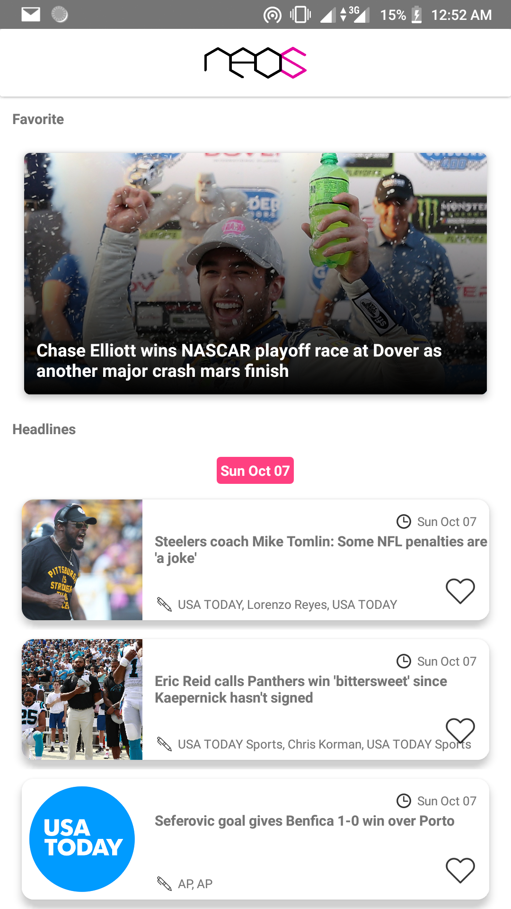

Neos is an Android Project uses [Google News API](https://newsapi.org), it displays all news that published by US Today in English.

The project contains only one activity `MainActivity.java` and it loads Headlines `getTodayNews();` & Favorite Article `getFavorite();` if user has in the local database of the smartphone, Feel free to try them and provide any feedback.

Neos main activity consists of two parts:

* *Favorite Articles*: and this is displayed in the upper side of the layout, it will appear only if user liked any articles;
* *Headlines*: and this shows all articles from [US Today](https://www.usatoday.com) source;
* *Neos SQLite*: this DB stores favorite articles for the user;

## Neos dependencies

*Neos dependencies* it uses more than one UI/UX dependencies:

* cardview ([com.android.support:cardview-v7:27.1.1](https://developer.android.com/guide/topics/ui/layout/cardview));
* picasso ([com.squareup.picasso:picasso:2.5.2](http://square.github.io/picasso/));
* sectioned recyclerview adapter ([sectionedrecyclerviewadapter](https://github.com/luizgrp/SectionedRecyclerViewAdapter)).

## Neos Shotscreens

*MainActivity.java*:

```Java
@Override
protected void onCreate(Bundle savedInstanceState) {
super.onCreate(savedInstanceState);
setContentView(R.layout.activity_main);
initView();
initActions();
getFavorites();
getTodayNews();
}
```

The code above initiates the mainView and initiates all actions, then get favorite articles if founded plus the main headlines!

Note that there are three kinds of items are displayed in the main screen, one for the favorite articles, one for the article of headlines, and the last one is the item of section which appears each day, to separate between days and each other.


